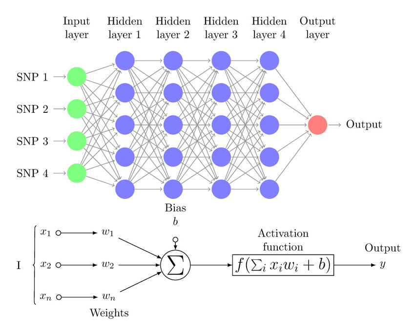

## Introduction

CNNs, especially their success in <a href="https://www.image-net.org/challenges/LSVRC/">ILSVRC</a>, played a major role in accelerating modern Deep Learning research, particularly in vision, and influenced progress across the field.

The primary goals of this blog is to understand: 

- Why was this **revolution** even needed in the first place?
- Factors that pushed in accelerating/streamlining this revolution.

## Feed Forward Network

One of the fundamental topics in Deep Learning is the **Feed Forward Network**, which is a broad category of Neural Networks where information flows in only one direction.
$$
input \, layer \,-->\, hidden \, layer(s) \,-->\, output \, layer
$$
There are no cycles or loops (as in recurrent architectures)

### Topology

- Input Layer: Recieves the data and passes the values forward
- Hidden Layer: This is the network's computation engine, they learn increasingly abstract features as layers increase
- Output Layer: Process the final result.

### Main Characteristics

- **Feed-Forward flow**: Info flows in one direction only.
- **Fully Connected**: Every neuron connects to every neuron in next layer.

An MLP is a specific type of feed-forward network, and while the terms are sometimes used interchangeably in informal contexts, they are not strictly the same. Characteristics include:

- Having atleast 3 layers (input, hidden, output)
- Being Fully Connected (every neuron in layer 1 connected to every neuron in layer 2)
- Non Linear Activation functions in hidden layers.

Let's dive a little deeper into MLPs

## Multi-Layer Perceptron

> <a href="https://www.programming-ocean.com/ai-architecutres/FFN-achitecture.php">Image Source</a>

As shown in the above image, A multi-layer perceptron can be broken down into 2 simple steps which are repeated across all the layers.

- Weighted Linear Combination of Inputs
- Non-Linear activation functions

**The weighted linear combination is pretty intuitive, but why activation functions?, and why specifically non-linear??**

Crux is: Stacking linear layers **does not increase representational power**, as the composition still reduces to a single linear transformation, regardless of the **number of layers**

*Illustration*

$$
L_1(x) = W_1x + b_1
$$
$$
L_2(L_1(x)) = W_2(W_1x + b_1) + b_2
$$
$$
L_2(L_1(x)) = (W_2W_1)x + (W_2b_1 + b_2)
$$

which effectively reduces down to $W'x + b'$, thereby exposing the fact that a 100 or 1000 layer linear network has the same power as that of a 1 layer network.

Activation functions introduce non-linearity, allowing the network to model complex, non-linear functions.

So, with non-linearity, the equation becomes $g(W_2 g(W_1x + b_1) + b_2)$, this helps the model learn complexity.

Another very interesting need for non-linear activation functions is the <a href="https://dev.to/jbahire/demystifying-the-xor-problem-1blk">XOR problem</a> and how without non-linear activations, problems like XOR are not linearly separable and therefore cannot be solved by such networks.

There are several different types of activation functions like: **ReLU, Sigmoid, TanH**, etc which are there to introduce non-linearity in the data.

Once we grasp the idea of a Multi-Layer Perceptron, the next question almost asks itself — can we use these networks on images?

Short Answer: **YES**, but it comes with significant challenges of it's own.

## Multi-Layer Perceptron for Images

Any image, effectively is a matrix. More specifically, Any digital image can be represented numerically as a tensor of pixel values.

For example:

A grayscale image is a 2D array of shape $(H \times W)$

An RGB image is a 3D array of shape $(H \times W \times 3)$ where the last dimension holds the R,G,B channels.

**Let's take the simpler case as an example, Suppose we take a grayscale image of size $28 \times 28$.**

To start off, we can't simply feed this matrix as is to the MLP

*Reason*: Traditional Fully Connected Layers expect 1 dimensional feature vector, not multi-dimensional arrays.

Since 1D feature vector is expected, the only choice to `flatten` the image, So a simple $28 \times 28$ image becomes a 1D tensor of size $784 \times 1$.

This flattening is what leads to some serious issues.

## Issues with MLP (Flattening of Images)

### **Issues 1: Destruction Of Spatial Structure**

Flattening of images throw away all the spatial information in the images which is very intuitive in itself.

For example, an image in the top left is treated the same way as the pixel in bottom right (if they have the same value) even though their spatial structure is critical for understanding the image.

This makes it hard for MLPs to learn about local patterns such as edges, textures, or shapes, which depend on neighboring pixels.

### **Issue 2: Lack of Translational Invariance**

From the previous limitation, this becomes an extension.

MLPs do not encode translation equivariance or invariance, meaning the same pattern appearing at different locations is treated as a different feature.

An example would make this more clear:

Imagine you are training a model for a binary classification task: Cats vs Dogs. You train the model on regular images of cats and dogs. During inference, you put a translated image of cat (eg. the cat appears at different location than the one it is trained for), due to MLP's limitation, it may fail to classify it correctly. This becomes a major issue when the number of classes increase.

### **Issue 3: Parameter Explosion**

Since we are using a grayscale image of size $28 \times 28$, effectively a $784 \times 1$ tensor, Even for a modest hidden layer of size 512, the number of parameters **explode**

$$
784 \times 512  \approx 400,000 \, parameters
$$

This leads to:
- Slow Training
- Massive Memory Usage
- High Risk of Overfitting.

### **Issue 4: No Spatial Inductive Bias**

MLPs treat all input dimensions uniformly, without encoding spatial relationships.

Images violate these assumption:

- nearby pixels are correlated
- patterns repeat across locations

The MLP has no built-in bias to exploit this.

## Conclusion

For a simple image of size $28 \times 28$, the issues were already severe, Imagine what would happen if we tried to use MLP on real life HD, 4K images.

These limitations is what pushed researchers into trying to develop more suitable networks for handling structured inputs making CNNs inevitable.

We will see in future blogs, how CNNs explicitly address many of these issues by introducing spatial locality, parameter sharing, and inductive bias.

### Takeaway

MLPs are:

- Powerful function approximators
- Foundational to Modern Deep Learning

But for structured inputs like images, they are the **WRONG** tool.

## Thus, CNNs are not an **Upgrade**, They are a **Correction**

### What Comes Next

The next step is to:

- formalize spatial locality
- introduce receptive fields
- show convolution as constrained linear layers

That transition will be made explicit in the next posts.

## TL;DR

A Multilayer Perceptron (MLP) is a fully connected, feed-forward neural network that relies on non-linear activations to model complex functions. While MLPs are powerful general function approximators, applying them directly to images requires flattening, which destroys spatial structure, causes parameter explosion, and removes crucial inductive biases like spatial locality and translation equivariance. These limitations make MLPs inefficient and poorly suited for vision tasks. Convolutional Neural Networks emerged not as a mere upgrade, but as a structural correction—explicitly designed to exploit the spatial nature of images through local connectivity, parameter sharing, and convolution.

Add this at the end of your post:

## Code Reference

The full implementation and experiments live at <a href="https://github.com/ScratchMind/ScratchVision">ScratchVision</a>

***

## References

- ImageNet Large Scale Visual Recognition Challenge (ILSVRC).  
  <https://www.image-net.org/challenges/LSVRC/>[1]

- Demystifying the XOR Problem.  
  <https://dev.to/jbahire/demystifying-the-xor-problem-1blk>[2]

- Feed Forward Neural Network Architecture – Programming Ocean.  
  <https://www.programming-ocean.com/ai-architecutres/FFN-achitecture.php>[2]